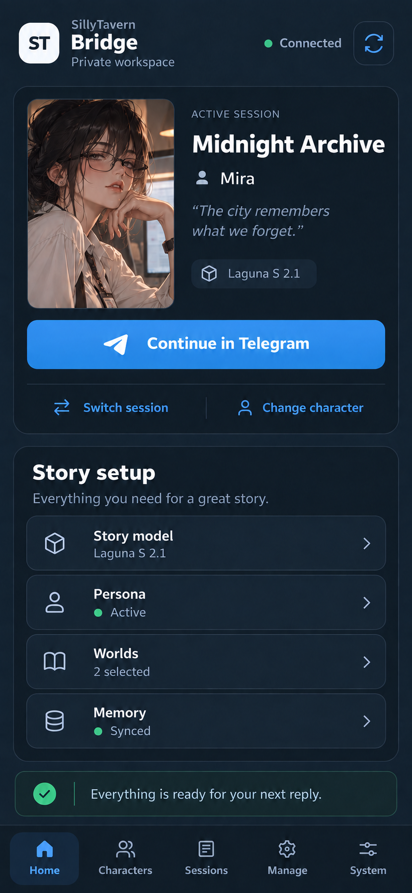
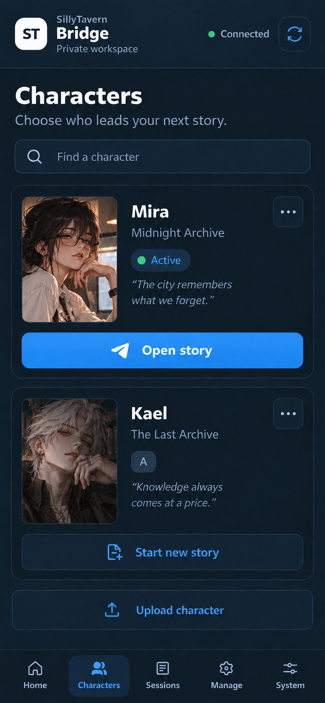
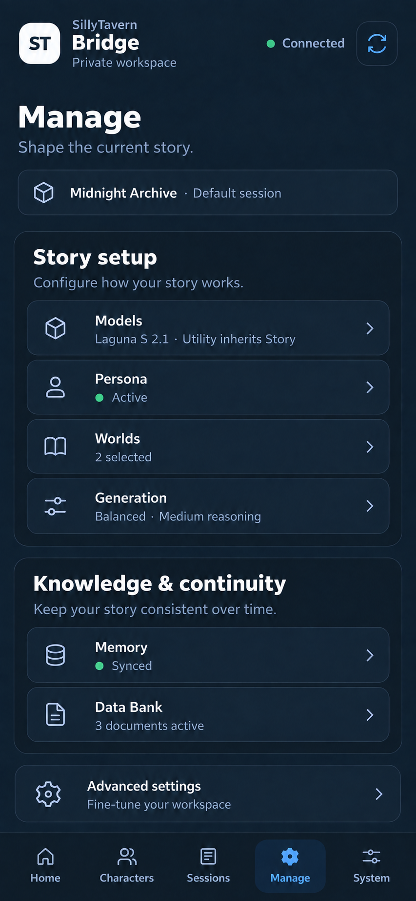

# 🌉 SillyTavern Telegram Bridge

[](https://github.com/cepeter/SillyTavern-Telegram-Bridge/actions/workflows/ci.yml)
[](https://github.com/cepeter/SillyTavern-Telegram-Bridge/releases/latest)
[](LICENSE)

Use your SillyTavern characters from Telegram while SillyTavern remains the owner
of character cards, Personas, World Info, System Prompts, and other native data.
The bridge adds Telegram sessions, memory, media handling, model/provider routing,
and an optional private management Mini App.

## Quick start

Linux installation is user-scoped. Before the first install, ensure `git` and `ssh-keygen` are available as described in [Installation](docs/installation.md#before-you-start). A first install uses an independently trusted maintainer key and verifies a signed release **before executing repository code**.

### 1. One-time trust setup

Create the external allowed-signers file once:

```bash
mkdir -p "$HOME/.config/sillytavern-telegram"
chmod 700 "$HOME/.config/sillytavern-telegram"
cat > "$HOME/.config/sillytavern-telegram/trusted-maintainers" <<'EOF'
cepeter namespaces="git" ssh-ed25519 AAAAC3NzaC1lZDI1NTE5AAAAIGRaxgobK+D+zdXdUzLb1xTQ2EPs9iYkeQGOOlepl+35 cepeter-release-signing
EOF
chmod 600 "$HOME/.config/sillytavern-telegram/trusted-maintainers"
awk '{print $3, $4, $5}' "$HOME/.config/sillytavern-telegram/trusted-maintainers" | ssh-keygen -lf -
```

Before trusting that file, independently compare the printed fingerprint through a separate trusted maintainer channel. The documented fingerprint is:

```text
SHA256:nCiZP+h1YWYCFjh37W8tXjR7oWGpZPF6bP4lbTOlAiI
```

Do not treat this README itself as the independent verification channel. See [Operations](docs/operations.md) for key rotation and revocation procedures.

### 2. Install latest signed release

Copy and paste this block. It clones without checking out files, selects the newest `v*` tag, verifies that tag against the external trust file, then creates local branch `main` at that verified release commit before running the installer:

```bash
set -euo pipefail
repo="https://github.com/cepeter/SillyTavern-Telegram-Bridge.git"
dest="$HOME/sillytavern-telegram-bridge"
signers="$HOME/.config/sillytavern-telegram/trusted-maintainers"

git clone --no-checkout "$repo" "$dest"
cd "$dest"
tag="$(git tag --list 'v*' --sort=-version:refname | sed -n '1p')"
test -n "$tag" || { echo "No release tag found" >&2; exit 1; }
git -c gpg.format=ssh \
  -c "gpg.ssh.allowedSignersFile=$signers" \
  -c gpg.minTrustLevel=fully verify-tag "$tag"
git checkout -B main "$tag^{commit}"
./install.sh --system-deps --no-start
```

The generated private `~/.local/share/sillytavern-telegram/.env` automatically points `SILLYTAVERN_UPDATE_ALLOWED_SIGNERS` at the same standard external trust file. Fill the Telegram bot/user ID, default model/provider, and provider credential, then start the normal Telegram bridge:

```bash
./install.sh --linger
```

For the optional Mini App, install/sign in to Tailscale and instead run:

```bash
./install.sh --with-tailscale-funnel --linger
```

This remains a real Git checkout on branch `main`, so the built-in verified `/update` flow keeps the same trust anchor. Alternative bootstrap, development, and release-archive paths are documented under [Advanced / development installation](docs/installation.md#advanced--development-installation).

The default Mini App listener is loopback-only; Tailscale Funnel provides public HTTPS while Telegram `initData` and the allowed-user list remain the application authorization boundary. See [Installation](docs/installation.md) for the full fresh-install, upgrade, systemd, and Tailscale procedure.

## What you can do

- Chat with native SillyTavern characters from Telegram.
- Keep multiple sessions with separate model, Persona, World Info, notes, memory,
  summaries, variants, and generation settings.
- Use text, images, documents, voice transcription, optional TTS, expressions,
  Data Bank retrieval, Hindsight memory, and Live Sync.
- Run forum-topic group scenes, Director goals, structured scene state, and Light
  Novel choice mode.
- Manage Characters, Optimizer proposals, models, sessions, Personas, Worlds,
  memory, Data Bank, status, and verified updates from the optional Mini App.
- Use a private provider catalog for OpenAI-compatible, native OpenAI Codex OAuth,
  Anthropic Messages, and OpenCode Muse routes without exposing provider credentials
  to Telegram clients.

For behavior and workflows, see the [User guide](docs/user-guide.md).

## Basic bot use

1. Start the bot and choose/configure a character and session.
2. Use `/start` to choose the opening greeting for a new or reset session.
3. Send normal messages to continue the conversation.
4. Use `/character`, `/session`, `/providers`, `/settings`, `/persona`, `/world`,
   `/memory`, and `/databank` to manage the active session.
5. Use `/status` for the current session/runtime summary.

Telegram `/help` is the **canonical command reference**. Use a command name for
focused detail, for example `/help scene refresh`. The repository documentation
explains concepts and workflows; `/help` reflects the executable command catalog.

## Mini App — planned design concept

> [!IMPORTANT]
> **Concept mockups — not shipped.** The current Mini App is documented in
> [Telegram Mini App](docs/miniapp.md). These images show an approved design
> direction for a future story-first mobile workspace; they are not screenshots
> of the current release.

The concept makes the active story and character the visual center, gives
**Continue in Telegram** one dominant action, consolidates story configuration,
and moves detailed usage and operations away from the first viewport.

<table>
  <tr>
    <th>Concept: Home</th>
    <th>Concept: Characters</th>
    <th>Concept: Manage</th>
  </tr>
  <tr>
    <td></td>
    <td></td>
    <td></td>
  </tr>
</table>

The intended navigation is **Home, Characters, Sessions, Manage, System**. It
uses larger mobile typography, progressive disclosure for secondary and
destructive actions, and fewer visually equivalent dashboard cards.

## Documentation

| Guide | Use it for |
|---|---|
| [Installation](docs/installation.md) | Fresh install, manual install, systemd, Tailscale Funnel, upgrades |
| [Configuration](docs/configuration.md) | `.env`, paths, providers, network policy, memory/RAG/voice settings |
| [User guide](docs/user-guide.md) | Bot workflows, sessions, generation, native assets, groups, media |
| [Operations](docs/operations.md) | Reliability, privacy, signed updates, downloads, database compatibility, troubleshooting |
| [Mini App](docs/miniapp.md) | Mini App security model, pages, Funnel deployment, installer behavior |
| [Token usage](docs/token-usage.md) | Provider-reported counts, coverage, privacy, retention and migration notes |

Project-level references:

- [Changelog](CHANGELOG.md)
- [Contributing](CONTRIBUTING.md)
- [Security policy](SECURITY.md)
- [Third-party notices](THIRD_PARTY_NOTICES.md)
- [License](LICENSE)

## Requirements

- Linux with user systemd for the maintained installer path.
- Python 3.11+ (the installer can provision user-local Python through pinned `uv`).
- A Telegram bot token and numeric Telegram user ID.
- SillyTavern data with at least one PNG character card, or the installer's starter
  card for initial setup.
- A configured Story model/provider route.
- Tailscale 1.52+ only when using the optional Mini App Funnel deployment.

Hindsight, embeddings, image generation, STT, TTS, Live Sync, and a separate
Utility model are optional.

## Safety and data ownership

Keep `.env`, provider credentials, databases, logs, cards, Personas, and private
prompts out of Git. External provider destinations are allowlisted; private/LAN
hosts require an additional opt-in. Uploaded documents and recalled context are
bounded and treated as untrusted input.

The bridge does not replace SillyTavern's native data model. Character, Persona,
and World edits use validation, reference checks, backups, and revision guards.
For deployment/update trust boundaries and recovery procedures, read
[Operations](docs/operations.md) and [Security](SECURITY.md).

## License

GNU General Public License v3.0. See [LICENSE](LICENSE).
