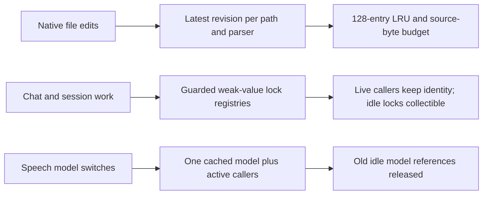

# Preproduction lifecycle and dead-code audit — 2026-10-02

## Scope and evidence

Reviewed `cepeter/SillyTavern-Telegram-Bridge` at base commit
`258e117e9dc99578f4cd1bb9ed243403787f8c8d`, in an isolated audit worktree.
The release is treated as preproduction: retired internal APIs need no
compatibility facades. Existing user data, migrations, queued operations,
public examples and the running deployment remain protected.

The audit covers runtime function references, compatibility paths, pytest
collection and support imports, CI/script entry points, and persistent
in-process caches/lock registries. AST absence is only a candidate signal:
framework callbacks, string registrations and test consumers were checked
before deciding whether removal was appropriate. This is source review and
deterministic lifecycle testing, not a live RSS soak or proof of zero leaks.

## Fixed retention findings

| Owner | Evidence before the fix | Change |
|---|---|---|
| `native_cache` native file cache | 100 edits to one file retain 100 revisions | One revision per path/parser kind, 128-entry LRU, 4 MiB total source-byte budget; oversize values bypass caching |
| `native_cache` text cache | 1,000 distinct keys retain all 1,000 entries | 128-entry LRU and 1 MiB UTF-8 key-plus-value budget |
| `background.chat_job_lock` | 1,000 released scope locks remain reachable after GC | Guarded weak-value registry; holders and waiters keep the same lock alive |
| `memory_backend.hindsight_session_lock` | Same retention for 1,000 historical sessions | Guarded weak-value registry, retaining reentrancy and mutual exclusion |
| `speech.transcribe_audio_bytes` | Switching models leaves earlier idle model objects reachable | Retain only the latest idle model; active calls retain their own strong reference |

Native source bytes are not the parsed Python heap size. Speech model eviction
does not promise immediate native allocator/RSS release. Alternating speech
models trades some reload latency for bounded idle-model retention.

## Removed dead and compatibility code

- `light_novel_repository.choice_set_for_assistant`: no runtime, test or reflective caller found.
- `ModelRouter.provider_spec`: no runtime caller; only an obsolete surface-presence assertion.
- `sync_api.live_sync_status_line`: no caller found.
- `limits.BACKGROUND_MAX_JOBS`: no reference; it was not the scheduler's active admission bound.
- Hindsight private SDK shutdown discovery and bridge-created fallback event loops.
  The hash-pinned `hindsight-client==0.10.0` supports public synchronous `close()`
  and asynchronous `aclose()`; cleanup now uses those lifecycles directly.
- The test-only `memory.close_hindsight_client` re-export. Tests target the owning module.

The private-client fallback test was replaced with a retirement assertion;
public sync shutdown and async purge failure/cleanup coverage remain. Test
fakes now implement the supported SDK lifecycle instead of requiring runtime
compatibility for mocks. No dependency or lockfile changes are needed.

## Tests and scripts retained

No entire test or script file was proved unused. Test modules are discovered
by pytest rather than imported by the application. `tests/conftest.py` is an
auto-discovered plugin, not an orphan. The five other Python support/fixture
modules have explicit consumers, including the browser smoke runner.
All eight tracked `tools/` files are referenced by CI, contributor/operator
documentation or governance tests. `install.sh` remains the installation entry
point. Existing behavioral/security regressions and public example fixtures
are preserved; only assertions for retired surfaces are changed.

## Additional test-only runtime surfaces

A runtime-only AST pass found these additional functions with test consumers:
`fail_choice_generation`, `persist_assistant_delivery_ids`, `parse_story_response`,
`find_npc_exact`, `list_episodic_memories`, `store_character_rank`,
`parse_npc_extraction`, and `grounded_user_label`.
They are not unreferenced. Some build/inspect fixtures; others expose a narrow
parser result or legacy behavioral assertion. Moving their consumers to canonical
APIs or dedicated test support is a follow-up cleanup, not justification for
removing the consuming regression files. They remain in this PR; the parser
surface also intersects the ongoing Light Novel work in PR #309.

## Preserved compatibility and lifecycle boundaries

SQLite migration history and historical delivery/document recovery remain:
preproduction status is not consent to discard existing sessions or queued work.
OpenAI-compatible provider parsing, Telegram/HTML framework callbacks, and
SillyTavern interchange formats are supported protocols, not dead shims.
The scheduler's admission limits, tracked-future release and queue cleanup,
Mini App runner lifecycle, and allowlisted per-user rate limiter were reviewed.
No additional reproducible unbounded retention was established there in this
pass; that is not a guarantee against cancellation/native-library leaks.

## Retention map

## Regression evidence and verification

Before fixes, the cache/lock regressions produced 15 expected failures and
5 passes; afterward all 20 passed. The retired SDK private-client protocol
regression failed before the lifecycle simplification and passed afterward.
The speech-cache probes produced 2 expected retention failures and 1 pass;
all 3 passed after bounding retention. A combined lifecycle/voice check passed
28 tests. Fake speech models avoid downloads, provider calls and real weights.

The first locked Python 3.11 full run, before the additional speech-cache fix,
passed 2,417 tests plus 775 subtests with 79.19% coverage. A fresh final full run
covers the speech change too; its exact results are recorded in the PR.
Dependency-lock validation, Ruff, formatting and the 99-file mypy surface pass.
The architecture gate remains 261 modules / 1,402 edges / zero cycles /
zero reciprocal pairs. Coverage floors are not lowered.

Author self-review checks active lock ownership, concurrent transcription,
cache copy isolation, parser namespaces, stale-load rejection, eviction budgets,
and the remaining tests' actual consumers. This is not independent approval.
The PR must still satisfy required GitHub checks for its exact head before merge.

No PR was merged and no deployment or release was performed by this audit.
