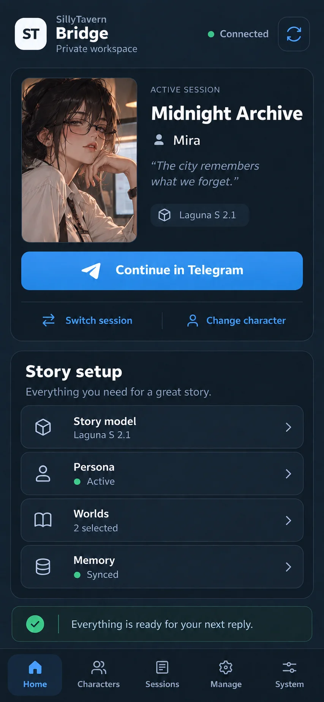
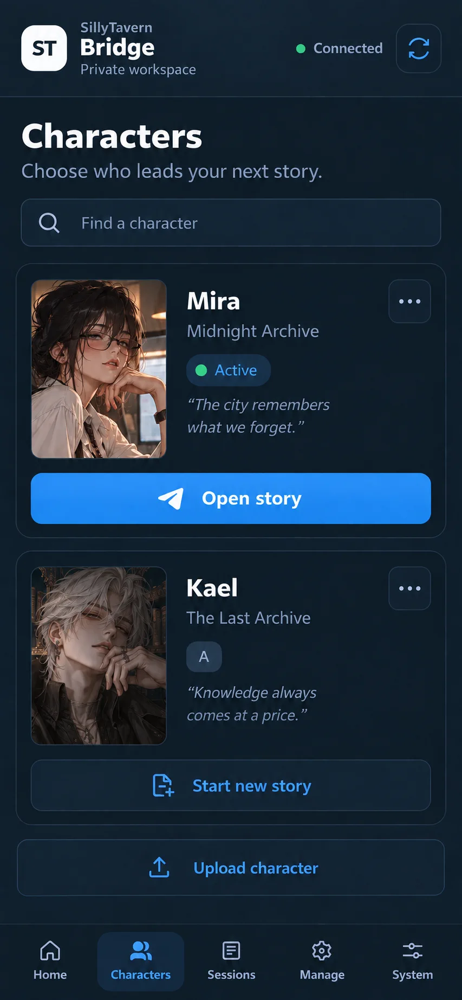
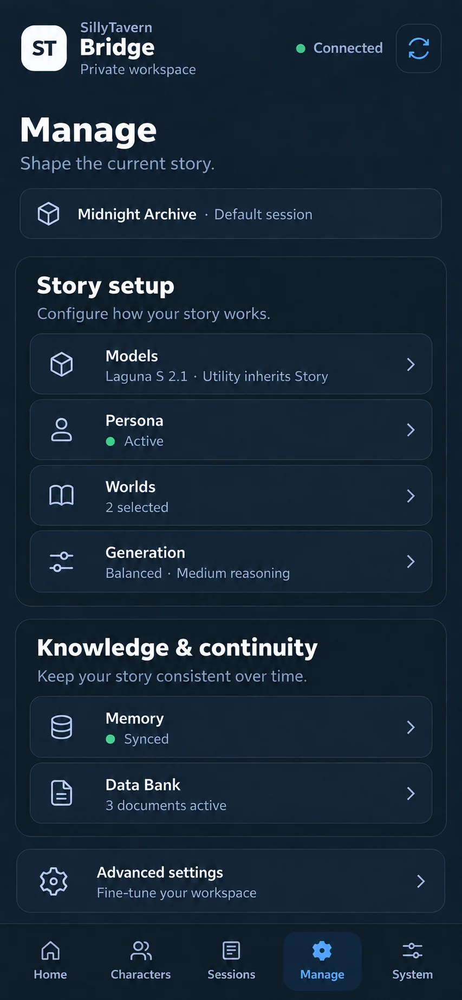

# Telegram Mini App

[Back to README](../README.md) · [Installation](installation.md) ·
[User guide](user-guide.md) · [Token usage](token-usage.md)

The Mini App is an optional management interface inside Telegram. You still chat
with characters through the bot. Use the app when a larger screen makes it easier
to browse cards, edit settings or review usage.

## Open the Mini App

After setup, open your bot's **private chat** and use its Bridge menu. Launching
from Telegram supplies the signed identity the app needs. Only users listed in
`SILLYTAVERN_TELEGRAM_ALLOWED_USERS` can open it.

A copied browser URL is not a separate login. If the session expires, reopen the
app from Telegram. The default signed-launch lifetime is one hour. Main Mini App
profile/deep links also need BotFather configuration.

The app manages private-chat sessions. Group chats and Forum Topics are not
authorized by a launch link. Allowed users can edit shared native characters,
Personas and Worlds; use separate bridge instances for mutually untrusted users.

## Find what you need

| Page | Use it for |
|---|---|
| **Home** | Return to the current story, open recent sessions and check bridge health. |
| **Characters** | Browse/search cards, upload, review optimizer proposals, restore backups or create a conversation. |
| **Sessions** | Create, rename, switch or delete inactive sessions. |
| **Manage** | Models, Personas, Worlds, Generation, Memory, NPC Bank, Data Bank and Advanced settings. |
| **System** | Running/installed version, operations, retained memory diagnostics and signed updates. |

For token counts, open **Manage → Advanced settings → Usage**. It reports
provider counters for the selected private session or all sessions in that chat.
See [Token usage](token-usage.md) for missing counters and coverage limits.

### Characters and optimizer

Choose a character to create a new normal session, then send `/start` in Telegram
for its opening. This leaves your existing conversation intact.

The Optimizer uses Utility to prepare an original/proposed preview. You can add
a Manual suggestion, review changes, then **Apply** or **Discard**. Apply checks
the original card revision and consumes the proposal once. An existing-filename
upload also needs a replacement preview. Active/default/referenced cards cannot
be deleted, and restores check the reviewed revision.

S–D badges are model-generated assessments. They use the shared
[rank assets](../assets/character-ranks/README.md); a static badge is used when
animation is unavailable or reduced motion is enabled.

### Models and generation

Story and Utility selections belong to the current session. Utility can inherit
Story. Provider credentials stay on the server.

Generation uses the same limits as Telegram: temperature 0–2, top-p 0–1, output
tokens 1–16,000, frequency/presence penalties −2–2, reasoning budget 0–32,000,
and up to four stop sequences of 100 characters. Reasoning offers named levels
plus Custom; provider support determines how a budget is applied. Presets belong
to your chat, and replacement/deletion requires confirmation.

### Personas, Worlds and memory

Personas use native settings and avatars. Creating one requires an existing
avatar; fresh installations include a starter. The World editor accepts JSON
or a file up to 1 MB and 2,000 entries. In-use native resources are protected from
deletion.

On Memory, **Save local list** edits curated facts locally. **Sync reviewed list**
publishes them to Hindsight, while **Clear session Hindsight memory** requests a
confirmed external purge. A failed connection is not treated as a successful
sync. Summary regeneration and curation use Utility.

NPC Bank shows supporting characters, visible fields and their history. **Refresh**
runs background extraction. Undo applies only to the latest visible field revision;
a concurrent update requires a fresh review. Restricted fields respect the active
character's `known_by` audience.

Data Bank documents belong to the private bot chat and can be shared by sessions
in that chat. Uploading the same filename creates a version. Search, activate an
older version, remove all versions of a filename, or reindex as needed. The input
limit is 10 MB. Full-text search remains available without embeddings.

### Slow operations and stale forms

Long tasks have an operation ID and a queued/running/completed outcome under
**System → Operations**. Identical retries reuse an admitted operation. Check its
status before submitting another task. After a restart, interrupted work is
marked for review rather than silently replayed.

A completed optimizer preview can be reopened from Operations without another
model call. Apply still checks the originating user/session and card revision.
Forms keep the session they were opened for; changing the active session does not
redirect an old confirmation. Refresh and review again when a form is stale.

## Setup with Tailscale Funnel

The supported public deployment uses Tailscale Funnel to proxy HTTPS to the
loopback listener at `127.0.0.1:8787`. Keep the HTTP port private. The app ships
with the bridge and needs no separate Node runtime or frontend build.

For a new installation, choose **Install + Tailscale Mini App** in the
[guided installer](installation.md). First install Tailscale **1.52+**, sign in
the device, and enable the required MagicDNS, HTTPS and Funnel policy. See the
[official Linux setup](https://tailscale.com/download/linux) and
[Funnel guide](https://tailscale.com/docs/features/tailscale-funnel).

To add the app to an existing installer-managed bridge with a working Python
environment, leave `SILLYTAVERN_MINIAPP_PUBLIC_URL` blank for URL discovery, then run:

```bash
cd ~/sillytavern-telegram-bridge
./install.sh --with-tailscale-funnel --linger --no-deps
```

`--no-deps` reuses the compatible environment so this step does not try to replace
packages while the service is active. If dependencies need repair or updating,
stop the service and follow the [manual update procedure](operations.md#manual-update).
Custom service units require an explicit `--replace-service` and are backed up.

An administrator can grant local daemon access with
`sudo tailscale set --operator="$USER"`. This does not grant Funnel policy
authorization. Run the bridge installer as the bridge user.

### URL and listener handling

Funnel is public; authentication comes from Telegram, not membership in your
tailnet. The installer discovers a `/miniapp/` URL when the configured URL is
blank. With no public URL and no Funnel setup, the listener stays disabled.

Discovery reuses an exact existing public mapping or selects an unused HTTPS
port from **443, 8443, 10000**. An explicit URL selects its port. Conflicting
listeners are refused; the installer does not convert an unrelated private Serve
service into a public one. Review the existing mapping before changing a URL or
backend port.

The installer checks the local page, expects unauthenticated API requests to be
refused, activates the selected Funnel listener, and verifies the mapping. Public
DNS propagation or a particular Telegram client's connectivity may still need
time or separate checking.

```bash
tailscale funnel status
systemctl --user status sillytavern-telegram.service
journalctl --user -u sillytavern-telegram.service -n 80 --no-pager
```

To turn off this listener, use the HTTPS port shown by `tailscale funnel status`.
For example, only if its port is 443:

```bash
tailscale funnel --https=443 off
```

Avoid `funnel reset` or `serve reset`; they also affect unrelated listeners.
Background Funnel mappings persist across restarts. `--no-start` can prepare a
blank URL but leaves the bridge and existing Funnel unchanged.

## Health, diagnostics and updates

Home shows bridge, Telegram, database and memory status. It uses lightweight
memory summaries, not full incident reports. System can show up to three retained
sanitized memory incidents. You can review retained reports even after monitoring
is disabled; the app cannot enable tracing, change thresholds or delete reports.
See [memory diagnostics](operations.md#memory-oom-diagnostics) for operator setup.

System distinguishes the running process from installed files. For updates, it
uses the same signed-release flow as `/update`, with an expiring confirmation.
It checks for a new process, the expected revision and resumed Telegram polling
before reporting completion. A restart request alone is not a completed update.

Changed runtime dependencies require the [manual signed update](operations.md#manual-update).
Keep the existing database and private `.env`; upgrading does not require a reset.
Update notifications are best effort and can be duplicated if a crash happens
between delivery and recording the acknowledgement.

## Troubleshooting

| What you see | What to do |
|---|---|
| The app will not open | Check service status and the exact Funnel mapping; launch from the private bot chat. |
| **401** | Reopen from Telegram; check that your numeric user ID is allowed. |
| **409** | The session, revision or confirmation changed. Refresh and review before trying again. |
| **429** | Check System → Operations for pending work before resubmitting. |
| **Interrupted** | The process restarted. Inspect the result; some actions may already have happened. |
| An optimizer preview will not apply | Check the original session/card revision and generate a new preview if it changed or expired. |
| Update appears installed but not running | Inspect the service log and running revision; a successful file update does not prove a successful restart. |

For service logs, provider failures and backups, see [Operations](operations.md).
For development-only UI checks, see [Contributing](../CONTRIBUTING.md#mini-app-ui-tests).

## Design previews

These are design references, not screenshots of your running bot. The app fills
names, portraits and status from the authenticated bridge.

<table>
  <tr><th>Home</th><th>Characters</th><th>Manage</th></tr>
  <tr>
    <td></td>
    <td></td>
    <td></td>
  </tr>
</table>
